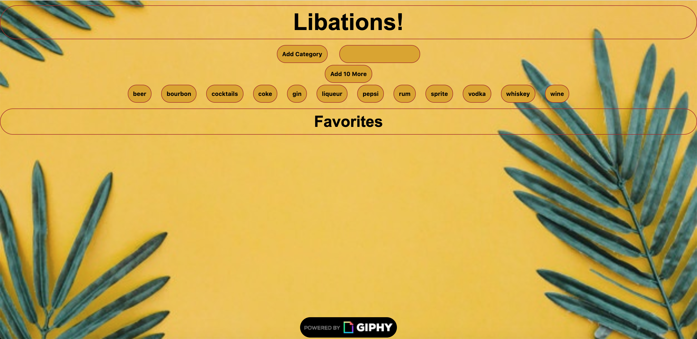
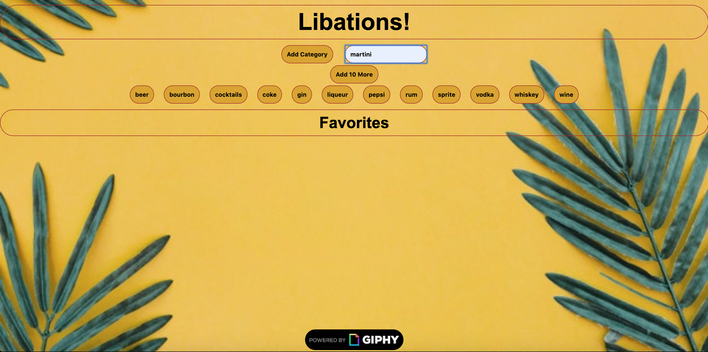

# GifTastic-Project

Who wants a few drinks from the Tiki Bar? This project was made using HTML, JavaScript, jQuery, and the GIPHY API. Enjoy!

Visit the project at https://lynnamsbury.github.io/GifTastic-Project/

## Instructions

When the user clicks on a button, the page grabs 10 static, non-animated gif images from the GIPHY API and places them on the page.

When the user clicks one of the still GIPHY images, the gif animates. If the user clicks the gif again, it stops playing.

The rating is under every gif.

A user input box at the top of the page allows the user to type in their own input and adds it into the topics array.

There's also a button that allows the user to add 10 more gifs when clicked.

